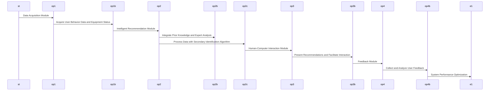

```mermaid
sequenceDiagram
    st->>op1: Data Acquisition Module
    op1->>op1b: Acquire User Behavior Data and Equipment Status
    op1b->>op2: Intelligent Recommendation Module
    op2->>op2b: Integrate Prior Knowledge and Expert Analysis
    op2->>op2c: Process Data with Secondary Identification Algorithm
    op2c->>op3: Human-Computer Interaction Module
    op3->>op3b: Present Recommendations and Facilitate Interaction
    op3b->>op4: Feedback Module
    op4->>op4b: Collect and Analyze User Feedback
    op4b->>e1: System Performance Optimization
```