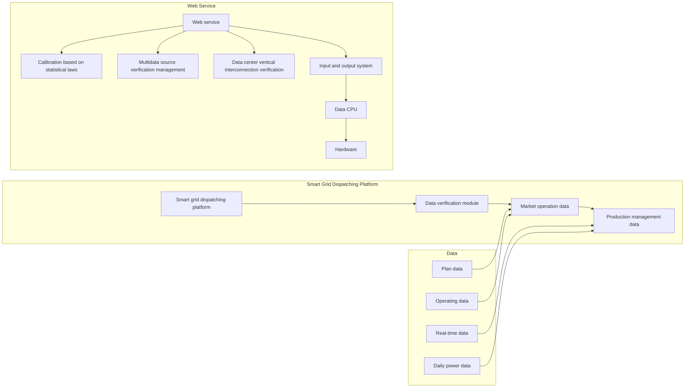

```mermaid
graph LR
    subgraph Smart Grid Dispatching Platform
      smart_grid_dispatching_platform[Smart grid dispatching platform]
      data_verification_module[Data verification module]
      market_operation_data[Market operation data]
      production_management_data[Production management data]
      smart_grid_dispatching_platform --> data_verification_module
      data_verification_module --> market_operation_data
      market_operation_data --> production_management_data
    end
    subgraph Web Service
      web_service[Web service]
      calibration_statistical_laws[Calibration based on statistical laws]
      multidata_source_management[Multidata source verification management]
      data_center_interconnection_verification[Data center vertical interconnection verification]
      input_output_system[Input and output system]
      data_cpu[Data CPU]
      hardware[Hardware]
      web_service --> calibration_statistical_laws
      web_service --> multidata_source_management
      web_service --> data_center_interconnection_verification
      web_service --> input_output_system
      input_output_system --> data_cpu
      data_cpu --> hardware
    end
    subgraph Data
      plan_data[Plan data]
      realtime_data[Real-time data]
      operating_data[Operating data]
      daily_power_data[Daily power data]
    end
    
    plan_data --> market_operation_data
    realtime_data --> production_management_data
    operating_data --> market_operation_data
    daily_power_data --> production_management_data
```